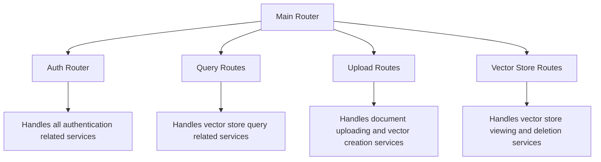
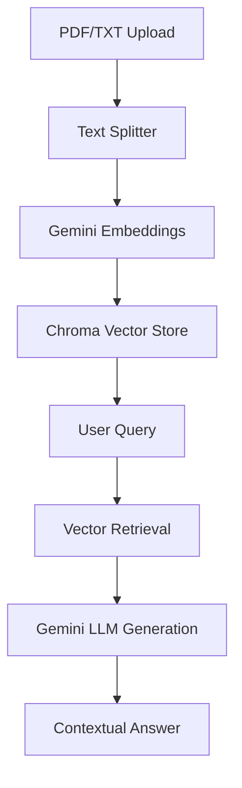

# 🧠 Retrieval-Augmented Generation (RAG) API  
A simple FastAPI application that allows you to:  
- Upload PDFs or text files  
- Create and persist vector stores (using FAISS or Chroma)  
- Retrieve relevant chunks for a query  
- Generate AI responses using Google’s Gemini model with retrieved context

***

## 🚀 Features

- Upload PDF/TXT documents via API  
- Automatic chunking with `RecursiveCharacterTextSplitter`  
- Create and persist vector stores using **FAISS** or **Chroma**  
- Query vector stores to retrieve semantically relevant chunks  
- Use **Gemini embeddings** for vector generation  
- Generate contextual AI responses using **Gemini LLM**

***

## 🧩 Architecture diagram of this project.



## ⚙️ Setup Instructions

### 1. Clone repository

```bash
git clone <your_repo_url>
cd <repo_name>
```

***

### 2. Create a virtual environment

```bash
python -m venv venv
source venv/bin/activate      # on macOS/Linux
venv\Scripts\activate         # on Windows
```

***

### 3. Install dependencies

```bash
pip install -r requirements.txt
```


***

### 4. Configure Environment Variables

Create a **`.env`** file in your project root with the following keys:

```bash
GEMINI_API_KEY=your_google_api_key_here
```

If you want to use your custom gemini models mention the model name here (by default it uses gemini-embedding-001):
```bash
GEMINI_EMBEDDING_MODEL=gemini-embedding-001
```
Specify your custom directory for stroing the vector db using this environment variable:

```bash
VECTOR_STORE_DIR=./vector_stores
```

***

### 5. Run the FastAPI server (with live reload)

run app 
```
python main.py
```

***

## 🧠 API Endpoints

### 1️⃣ Upload and Create Vector Store

**Endpoint:** `POST /upload-document/`  
Uploads a PDF/TXT file and creates a vector store from it.

**Request (Form Data):**
```
file: (Upload .pdf or .txt)
vector_store_name: (optional custom name)
```

**Response Example:**
```json
{
  "message": "Document processed successfully",
  "vector_store_name": "my_document_vectorstore",
  "chunk_count": 36
}
```

***

### 2️⃣ Query Vector Store

**Endpoint:** `POST /query/`  
Performs semantic search on the stored vectors and returns relevant chunks.

**Request Example:**
```json
{
  "query": "Explain the role of AI in data analysis?",
  "k": 4,
  "vector_store_name": "my_document_vectorstore"
}
```

**Response:**
```json
{
  "results": [
    {
      "rank": 1,
      "content": "AI automates pattern recognition in data...",
      "similarity_score": 0.87
    }
  ]
}
```

***

### 3️⃣ Query with Context and AI Response

**Endpoint:** `POST /query-context/`

Uses the retrieved chunks as context and sends a structured prompt to Gemini for a grounded response.

**Request Example:**
```json
{
  "query": "Summarize how artificial intelligence works in simple terms.",
  "vector_store_name": "my_document_vectorstore",
  "k": 3
}
```

**Response Example:**
```json
{
  "query": "Summarize how artificial intelligence works in simple terms.",
  "response": "AI works by using patterns learned from data...",
  "context_used": "Context text retrieved from your PDF...",
  "chunk_count": 3
}
```

***

## 🧪 Testing with cURL

Upload a file:
```bash
curl -X POST "http://localhost:8000/upload-document/" \
  -F "file=@sample.pdf" \
  -F "vector_store_name=my_store"
```

Query it:
```bash
curl -X POST "http://localhost:8000/query/" \
  -H "Content-Type: application/json" \
  -d '{"query":"What is AI?","vector_store_name":"my_store"}'
```

Generate AI-augmented answers:
```bash
curl -X POST "http://localhost:8000/query-context/" \
  -H "Content-Type: application/json" \
  -d '{"query":"Briefly explain AI","vector_store_name":"my_store"}'
```

***

## 🧰 Tech Stack

| Component | Purpose |
|------------|----------|
| **FastAPI** | REST backend |
| **LangChain** | RAG integration & text splitting |
| **FAISS / Chroma** | Vector similarity search |
| **Google Gemini API** | Embeddings and text generation |
| **PyMuPDF (fitz)** | Efficient PDF reading |
| **dotenv** | Environment variable management |

***

## 📦 Example Embedding & Retrieval Flow



